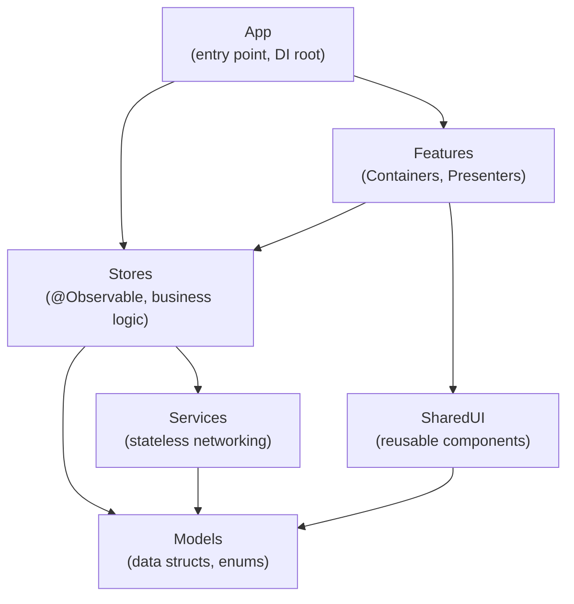

# SwiftUI Architecture Review

Review SwiftUI projects for MV (Model-View) pattern compliance. Verify that the architecture eliminates the ViewModel layer and follows SwiftUI's built-in design.

## Review Process

1. **MV pattern compliance** - Check for ViewModel classes or per-screen ObservableObjects. See `references/mv-pattern.md`.
2. **Container/Presenter separation** - Verify screen-level views are split into data-fetching Containers and pure-UI Presenters. See `references/container-presenter.md`.
3. **Aggregate Root Model (Store) design** - Verify Stores are organized by domain, not per-screen. See `references/aggregate-root-model.md`.
4. **State placement** - Verify UI state lives in Views, business logic in Stores, networking in Services. See `references/state-placement.md`.
5. **Sheet/navigation management** - Verify sheets use a single enum, not multiple Bool flags. See `references/sheet-navigation.md`.
6. **View composition and performance** - Verify aggressive view decomposition, minimal data passing, and proper composition. See `references/composition-performance.md`.
7. **Testing strategy** - Verify tests focus on business logic (Store/Service) and test behavior, not implementation. See `references/testing-strategy.md`.

If doing a partial review, load only the relevant reference files.

## Core Architecture Rules

### MV Pattern (not MVVM)
- **No ViewModel layer** - SwiftUI property wrappers already serve the ViewModel role
- Views interact with Stores directly via `@Environment`
- UI validation can stay in the View (it is not business logic)
- Networking belongs in stateless Services

### Container/Presenter
- **Container (screen)**: fetches data, talks to Stores/Services, manages `.task`
- **Presenter (display)**: receives data via `let` properties and closures, renders UI only
- Small components do not need this split (avoid over-separation)

### State Placement
- `@State`, `@Binding` -> inside Views (UI state)
- Business logic -> Store (`@Observable` class)
- Networking -> Service (stateless struct)

### Sheet/Navigation
- Manage sheets with a single `enum` (no Bool flags)
- Prefer `.sheet(item:)` over `.sheet(isPresented:)`
- Inject Stores via Environment at the NavigationStack level or higher

### Testing
- Test business logic in Stores and Services
- Behavior tests over implementation tests
- Avoid excessive mocking

## Expected Project Structure

The MV pattern expects the following file organization. Features are grouped by domain, not by layer.

```
MyApp/
├── MyAppApp.swift                  # App entry point, Store injection
├── Models/
│   ├── Order.swift                 # Data models (structs)
│   └── User.swift
├── Stores/
│   ├── OrderStore.swift            # @Observable, domain-scoped business logic
│   └── UserStore.swift
├── Services/
│   ├── OrderService.swift          # Stateless networking (struct)
│   └── UserService.swift
├── Features/
│   ├── OrderList/
│   │   ├── OrderListContainer.swift    # Container: fetches data, talks to Store
│   │   ├── OrderListView.swift         # Presenter: pure UI, receives data via let/closures
│   │   └── OrderRowView.swift          # Small reusable component
│   ├── OrderDetail/
│   │   ├── OrderDetailContainer.swift
│   │   └── OrderDetailView.swift
│   └── Settings/
│       └── SettingsView.swift          # Simple screens may not need Container/Presenter split
├── Shared/
│   ├── SheetType.swift             # Single enum for sheet management
│   └── Components/                 # Reusable small UI components
│       ├── StatusBadge.swift
│       └── AmountLabel.swift
└── Tests/
    ├── Stores/
    │   └── OrderStoreTests.swift   # Business logic tests (behavior, not implementation)
    └── Services/
        └── OrderServiceTests.swift # Integration tests with real dependencies
```

### Key Points

- **No `ViewModels/` directory** - ViewModels do not exist in the MV pattern
- **Stores are domain-scoped** - `OrderStore`, not `OrderListViewModel` + `OrderDetailViewModel`
- **Services are stateless structs** - no UI state, just perform work and return results
- **Container/Presenter pairs per feature** - Container handles data, Presenter handles UI
- **Simple screens skip the split** - not every screen needs a Container/Presenter pair
- **Tests target Stores and Services** - not Views

### Module Dependency Graph

When the project uses Swift Package modules (e.g., local packages), the expected dependency direction is as follows. Arrows indicate "depends on".



**Dependency rules:**

- **App** depends on everything (it is the DI root that wires Stores into the Environment)
- **Features** depend on Stores (Containers access Stores) and SharedUI, but never on Services directly
- **Stores** depend on Services (for networking) and Models (for entities)
- **Services** depend only on Models (stateless, no UI or Store references)
- **SharedUI** depends only on Models (pure UI components, no business logic)
- **Models** depend on nothing (leaf module)
- **No circular dependencies** - arrows always point downward
- **Features never import Services** - all data flows through Stores

## Output Format

Organize findings by category. For each issue:

1. State the file and relevant line(s).
2. Name the architecture rule being violated.
3. Show a brief before/after code fix.

Skip categories with no issues. End with a prioritized summary.

### Example Output

#### MV Pattern Violation

**`Features/Order/OrderListViewModel.swift` - Unnecessary ViewModel layer**

```swift
// Before: unnecessary ViewModel
class OrderListViewModel: ObservableObject {
    @Published var orders: [Order] = []
    func fetch() async { ... }
}

// After: Store + Container/Presenter pattern
@Observable @MainActor
final class OrderStore {
    var orders: [Order] = []
    func fetch() async { ... }
}

struct OrderListContainer: View {
    @Environment(OrderStore.self) private var store
    var body: some View {
        OrderListView(orders: store.orders)
            .task { await store.fetch() }
    }
}
```

#### Sheet Management

**`ContentView.swift:15-17` - Bool flags for sheet management**

```swift
// Before
@State private var showingProfile = false
@State private var showingSettings = false

// After
enum SheetType: Identifiable { ... }
@State private var activeSheet: SheetType?
```

### Summary

1. **MV pattern (high):** 3 ViewModel files found. Migrate to the Store pattern.
2. **Sheet management (medium):** Bool flags in 2 places. Unify with enum management.

End of example.

## References

- `references/mv-pattern.md` - MV pattern principles and criteria for eliminating ViewModels
- `references/container-presenter.md` - Container/Presenter responsibility separation
- `references/aggregate-root-model.md` - Aggregate Root Model (Store) design guidelines
- `references/state-placement.md` - State placement rules (View / Store / Service)
- `references/sheet-navigation.md` - Sheet and navigation management best practices
- `references/composition-performance.md` - View composition and performance guidelines
- `references/testing-strategy.md` - Testing strategy (behavior tests vs implementation tests)
